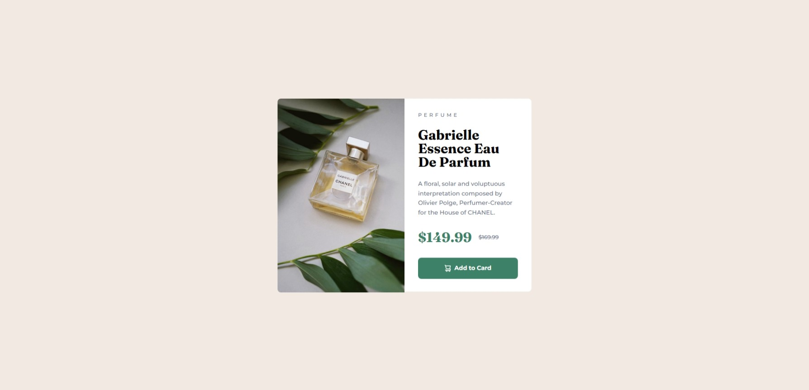

# Frontend Mentor - Product preview card component solution

This is my solution to the [Product preview card component challenge on Frontend Mentor](https://www.frontendmentor.io/challenges/product-preview-card-component-GO7UmttRfa).

## Table of contents

- [Overview](#overview)
  - [The challenge](#the-challenge)
  - [Screenshot](#screenshot)
  - [Links](#links)
- [My process](#my-process)
  - [Built with](#built-with)
  - [What I learned](#what-i-learned)
- [Author](#author)

## Overview

### The challenge

Users should be able to:

- View the optimal layout depending on their device's screen size
- See hover and focus states for interactive elements

### Screenshot



### Links

- Live Site URL: [Live site URL](https://product-preview-card-omega-seven.vercel.app/)

## My process

### Built with

- Semantic HTML5 markup
- CSS custom properties
- Flexbox
- CSS Grid

### What I learned

One thing I learned was how to use two images based on the screen size.
In the past, I used _background-image_ with media queries to change the image according to the viewport width.
I discovered that this solution is not ideal because screen readers do not recognize background images.

The best solution to this was to use <picture> tag. See the code below:

```html
<picture class="product-image">
  <source
    media="(min-width: 700px)"
    srcset="images/image-product-desktop.jpg"
  >
  
</picture>
```

Here, I use two images. The desktop version is displayed when the screen width is 700px or higher, and the mobile version is used below that.

## Author

- Frontend Mentor - [@Vinicius-PR](https://www.frontendmentor.io/profile/Vinicius-PR)
- Linkedin - [@Vinicius](https://www.linkedin.com/in/vinicius-paula-resende/)